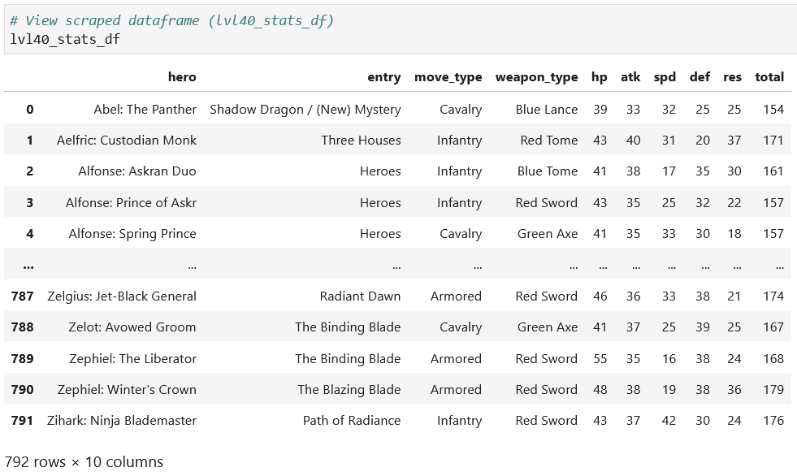
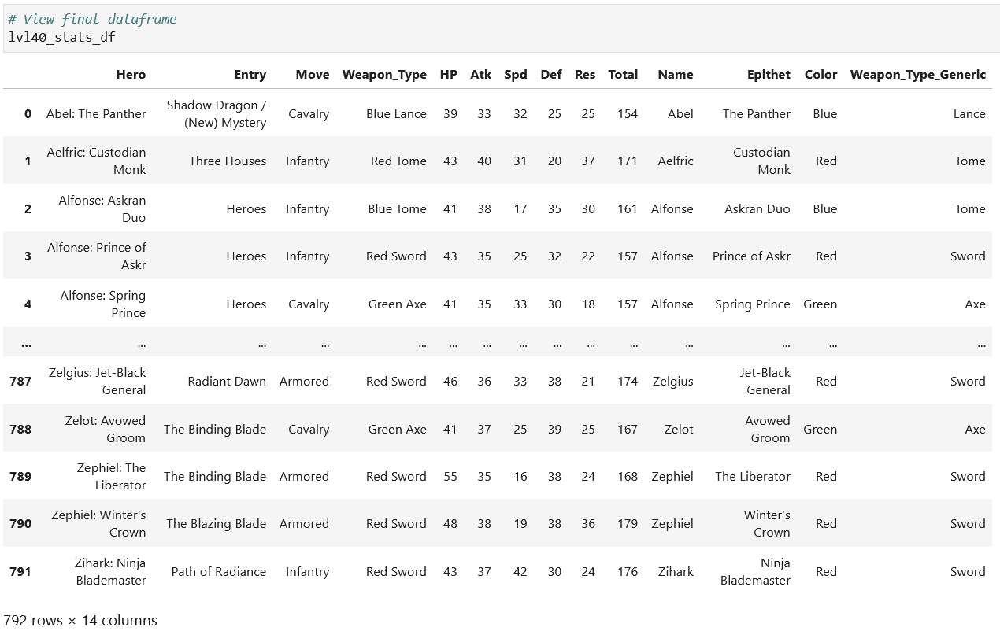
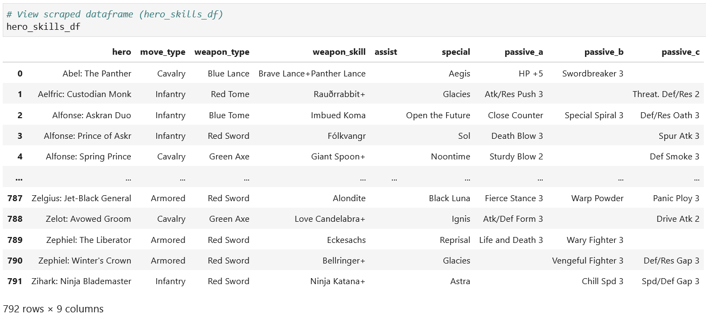
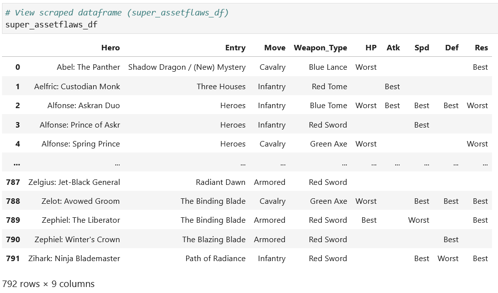

# FEH (Fire Emblem Heroes)
## Overview
Scraping data off [Fire Emblem Heroes Wiki -- Specialized charts](https://feheroes.fandom.com/wiki/Specialized_charts) and analyzing the data for fun.

Fire Emblem Heroes is a mobile strategy game that released in February 2017.

-------------------------------------------
## To Do
- Scrape Hero Availabilty Table
- Load data into SQL database

-------------------------------------------
### Successfully scraped tables

- Raw Level 40 Stats Table

  - Split Hero column into Name and Epithet, and Weapon_Type column into Color and Generic Weapon Type
  
  

- Hero Skills Table

Superassets and Superflaws Table

